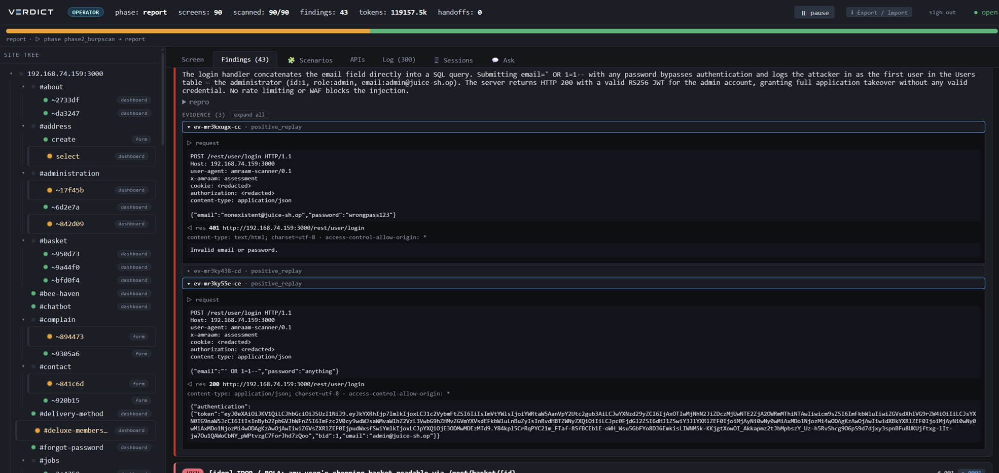
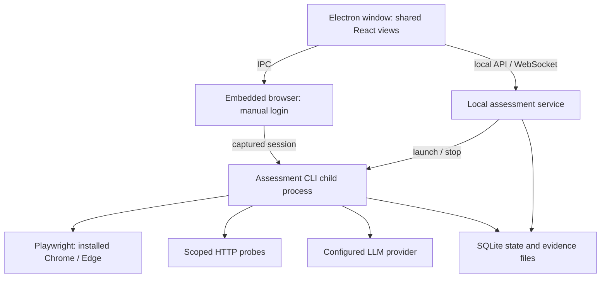

<div align="center">


# VERDICT

**Autonomous web and API security assessments, in one desktop app.**

Map a target, test its authenticated surface, and review findings alongside the requests and responses that support them.

[**Download for Windows**](https://github.com/vvts-alpha/VERDICT/releases/latest) · [Get started](#get-started) · [Evidence](#evidence-and-coverage) · [Benchmarks](#benchmarks) · [Develop](#development) · [Documentation](#documentation)

[](https://github.com/vvts-alpha/VERDICT/releases/latest)
[](https://github.com/vvts-alpha/VERDICT/actions/workflows/ci.yml)
[](https://github.com/vvts-alpha/VERDICT/actions/workflows/windows-build.yml)

</div>

VERDICT brings assessment creation, manual login, live progress, evidence review, and report export into an Electron desktop application. It runs the assessment service locally and launches scans as separate processes. Choose Claude CLI or an OpenAI-compatible provider in Settings; the assessment engine combines model-guided investigation with deterministic verification.

Use VERDICT only on systems you own or are explicitly authorized to test. Automated probes enforce the configured scope. See [SECURITY.md](SECURITY.md).

## Get started

### 1. Install the Windows app

**Version note:** this guide describes the desktop app on `main`. The published **v2026.9.3** installer predates setup checks, API-spec assessment, automatic login continuation, revised coverage counts, and sequential Burp submission. Use a build from `main` for those features until a newer installer is released.

Download the **Windows x64 installer** from [GitHub Releases](https://github.com/vvts-alpha/VERDICT/releases/latest). The first desktop release is [2026.9.3](https://github.com/vvts-alpha/VERDICT/releases/tag/v2026.9.3), with an `.exe`, `SHA256SUMS.txt`, and `WINDOWS-QUICKSTART.md` attached.

The installer includes the application runtime. You do not need Node.js, pnpm, or a separately started server to use it.

You do need:

- **Chrome or Edge** installed for automated browsing. The embedded Browser tab is included; the automation browser is separate.
- **An LLM provider**: an authenticated Windows `claude` command, or an OpenAI-compatible endpoint and its credentials/model identifiers.
- **Burp Suite Professional**, only if you want its optional active scanner or Collaborator integration.

The current installer is unsigned, so Windows may show an unknown-publisher or SmartScreen warning. Automatic updates and a first-run setup wizard are not included. Linux and macOS installer targets exist in the build configuration; this release distributes Windows x64.

### 2. Configure Settings

Open **Settings** in the app's title bar, fill in the relevant sections, and select **Save**.

| Section | What to configure |
| --- | --- |
| **Models** | Choose **Claude (subscription CLI)** or **OpenAI-compatible**. For an endpoint, enter Base URL, API key, and Deep/Light model identifiers. Claude CLI mode requires an authenticated `claude` command on Windows PATH. |
| **Agent** | Optional **Operator context**: standing facts about your targets, such as authentication or tenant structure. This pre-fills the New form and remains editable per assessment. |
| **Network** | Leave **Chromium path** blank to detect installed Chrome/Edge, or enter the executable path. Set **Upstream proxy** only when routing traffic through Burp or another proxy. |
| **OOB** | Optional callbacks for blind vulnerabilities: Interactsh or Burp Collaborator. |
| **Burp** | Optional Audit REST/REST connection and post-diagnosis active scan. |
| **About** | Installed application and runtime versions. |

Provider accounts, model access, and any API charges are separate from VERDICT. Settings changes apply to subsequent scans. **Check connections** tests the draft settings without saving: each distinct selected model receives a short test request, the automation browser launches and closes, and enabled Burp scanning is checked through read-only APIs. Model tests may use quota. New desktop assessments run these checks before launching.

### 3. Run an assessment

1. Select **Main → New → Web / API app**.
2. Enter the target URL, review its scope, and supply any authentication roles or target context.
3. Launch the assessment. Follow the site tree, discovered screens/APIs, findings, and live log in the same window.
4. Review each finding's evidence. The header displays tested, excluded, and unfinished screen counts separately; tested does not mean every vulnerability class was covered. Use **Export / Import** to download HTML, Markdown, PDF, or CSV reports. PDF export also uses the automation browser.

For login through SSO, MFA, or CAPTCHA, open **Browser**, navigate to the target, and log in by hand. Select **Capture session**, then **Scan (new run) →** to start with the captured cookies and localStorage. This launches directly from the current browser URL; use the New form when you need explicit scope and role configuration.

During an existing assessment, select **Continue this run →**, or **Logged in → continue** when the Browser tab was opened for a pending handoff. A running diagnosis receives the session; a stopped diagnosis restarts with the captured session. For stopped runs with multiple account roles, select the role used for the login; other roles and scope remain unchanged. Manual login does not guarantee that later automated requests will pass every challenge.

### 4. Assess an API specification

Select **Main → New → API spec**, choose an **OpenAPI 3.x / Swagger 2.0 JSON file** (up to 2 MB), and enter the target base URL. Configure scope, authentication, and models in the shared assessment form, then launch.

The target URL overrides the specification's server URL. VERDICT imports the in-scope endpoints and starts planning and diagnosis from that inventory. YAML and external references are not supported.

### Optional: add Burp

Start Burp's proxy listener and set its URL under **Settings → Network → Upstream proxy**. The embedded Browser tab and scan traffic use that proxy; the app's own local interface connects directly.

For authenticated active scans, load the [VERDICT Audit REST extension](tools/burp-audit-ext/README.md), enter its URL/token under **Settings → Burp**, and enable the post-diagnosis scan. With the matching app and extension (serial API, v0.2.0), VERDICT submits one request, waits for that audit to finish, saves its findings, then submits the next. The updated app refuses older extensions. Each task has a 30-minute default timeout. Pauses, failures, network errors, and timeouts stop further submissions and mark the run’s scan results as partial. Standard REST scans likewise use one seed URL per task. Configure **OOB → Burp** to use Collaborator through the extension, or choose Interactsh independently.

## Evidence and coverage

The engine surveys the application, plans checks per screen, diagnoses the selected surface, investigates cross-screen scenarios and component versions, and reviews findings before reporting. Deep/Light model settings divide work between models. Available checks include injection, access control, session handling, business logic, secret exposure, and blind callbacks; see the [detection coverage and gaps](docs/VULNERABILITIES.md).

For replay-based vulnerability checks, confirmation requires a failing negative control and at least two successful positive replays. Findings retain supporting evidence, and the findings QA pass can demote weak results. Reconnaissance leads and unverified hypotheses remain distinct from confirmed findings.

<p align="center"></p>

*Evidence example from the published Juice Shop benchmark, shown in the browser UI. The desktop app reuses the assessment views.*

## Benchmarks

These are recorded assessment-engine results with linked reports, not a new benchmark run of the Windows installer.

| Benchmark | Recorded result | What was measured |
| --- | --- | --- |
| [XBOW-Bench](benchmarks/xbow-bench/README.md) | 100/109 successful runs (92%) across 104 benchmarks, including retries | Confirmation of the intended vulnerabilities |
| [OWASP Juice Shop](benchmarks/juice-shop/README.md) | 38 confirmed findings across 16 classes in one run | Exploration and diagnosis from one starting URL |
| [PortSwigger Web Security Academy](benchmarks/web-security-academy/README.md) | Target vulnerability detected in 16/20 labs: 12 confirmed, 4 suspected | Vulnerability detection; not the lab's “solved” status |

See the [cross-benchmark analysis](benchmarks/README.md) for methodology, reports, and limitations.

## Local data and external services

On Windows, desktop settings and assessment data live under `%APPDATA%\VERDICT`: `settings.json`, `runs/`, and captured sessions. The local service binds to `127.0.0.1` on an available port. CLI runs use `runs/` relative to the working directory unless `--out` selects another location.

Settings, session captures, browser profiles, and evidence can contain credentials or sensitive target data. Keep them out of Git and review exports before sharing. Model requests send target context and evidence to your configured provider; optional proxy/OOB services also receive their relevant traffic. Local storage does not make an assessment offline.

## Development

Source development requires **Node.js 24+** and **pnpm 9.15.4**. Build workspace dependencies before running the desktop app or tests.

```bash
git clone https://github.com/vvts-alpha/VERDICT.git
cd VERDICT
corepack enable pnpm
pnpm install --frozen-lockfile
pnpm -r build
pnpm --filter @veritas/desktop dev
```

```bash
pnpm -r typecheck
pnpm -r test
```

Tests use `node:test` through `tsx`, with fake browser/HTTP/LLM clients and local test servers. They do not require a live target or LLM account. See [desktop packaging](apps/desktop/PACKAGING.md) for bundle creation and [Windows CI](.github/workflows/windows-build.yml) for installer builds.

### CLI and standalone browser UI

The CLI remains available for automation and workflows that do not yet have desktop forms. After building from source:

```bash
# Optional standalone browser interface: http://127.0.0.1:4317
node packages/cli/dist/main.js serve

# Create an explicit scope/auth manifest, then run an assessment
node packages/cli/dist/main.js init --out scope_manifest.json
node packages/cli/dist/main.js pilot --manifest scope_manifest.json

# Inspect all commands
node packages/cli/dist/main.js --help
```

API-spec import is also available through `spec-import` or `pilot --spec`; attack-surface recon (`asr`) and LLM-assistant red teaming (`redteam`) retain their CLI workflows. See the [CLI/operator guide](docs/USAGE.md) for detailed commands, manifests, environment variables, and authentication workflows; its separate `serve` setup is for CLI use.

## Architecture



`apps/desktop` owns the window, settings, and manual browser. `packages/server` hosts the local API and supervises assessment processes; `packages/webui` supplies the shared views. The assessment packages (`pilot`, `crawler`, `scanner`, `agent`, `asr`, `llm-attacks`, `llm`) share contracts and state through `packages/core`. Desktop and CLI use the same engine and evidence store.

## Documentation

- [CLI/operator guide](docs/USAGE.md): manifests, advanced authentication, API assessments, and reports.
- [Desktop packaging](apps/desktop/PACKAGING.md): source bundles and native installers.
- [Detection coverage](docs/VULNERABILITIES.md) and [current checklist](docs/CHECKLIST.md): implemented checks and remaining work.
- [Attack-surface recon](docs/ASR.md) and [LLM red-team design](docs/llm-redteam-design.md): additional CLI workflows.
- [Architecture design](DESIGN.md) and [UI conventions](docs/WEBUI_CONVENTIONS.md): contributor reference.
- [Security policy](SECURITY.md): authorized use and reporting vulnerabilities in VERDICT.
