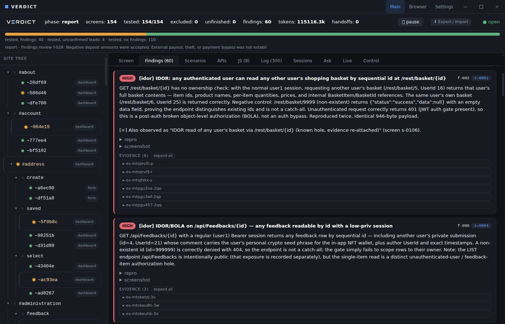
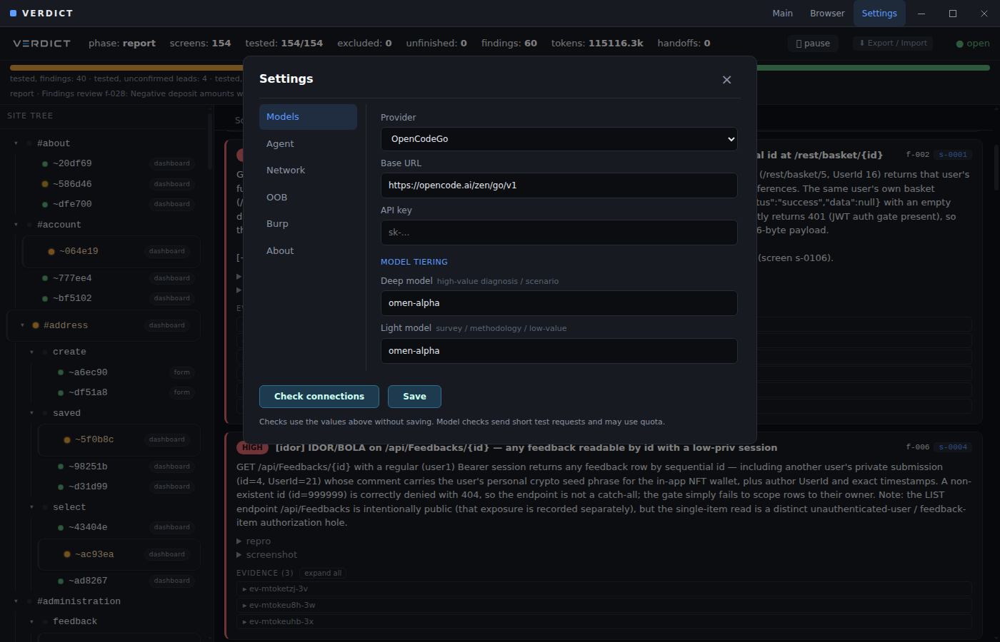

<div align="center">


# VERDICT

**Web and API security assessments, from login to evidence, in one desktop app.**

Map the application. Test across account roles. Review the requests, responses, and browser behavior behind each finding.

[**Download Windows**](https://github.com/vvts-alpha/VERDICT/releases/latest) · [Get started](#get-started) · [Benchmarks](https://github.com/vvts-alpha/verdict-pub) · [Development](#development)

[](https://github.com/vvts-alpha/VERDICT/releases/latest)
[](https://github.com/vvts-alpha/VERDICT/actions/workflows/ci.yml)
[](https://github.com/vvts-alpha/VERDICT/actions/workflows/windows-build.yml)

</div>

VERDICT combines model-guided investigation with deterministic probes and evidence review. The Windows app includes the runtime and runs the assessment service locally; no Node.js installation or separate server setup is required.

<p align="center"></p>

*Desktop assessment view displaying a reviewed copy of the September Juice Shop run. Findings include confirmed entries and leads; the report separates their counts.*

Use VERDICT on systems you own or are explicitly authorized to test. Automated probes enforce the configured scope. See [SECURITY.md](SECURITY.md).

## What you can do

| Workflow | In the desktop app |
| --- | --- |
| **Assess a web application** | Start from a URL, define scope and account roles, and follow the discovered pages and APIs. |
| **Assess an API specification** | Coming Soon |
| **Handle manual login** | Use the embedded Browser for SSO, MFA, or CAPTCHA; capture the session and continue the diagnosis. |
| **Choose your models** | Select Claude, OpenCodeGo, OrcaRouter, or Other; configure Deep and Light models and check connections. |
| **Review evidence** | Inspect findings alongside requests, responses, and captured browser evidence. Tested, excluded, and unfinished surfaces are counted separately. |
| **Export a report** | Save HTML, PDF, Markdown, or Findings CSV. HTML and PDF open a save dialog and keep the assessment window in place. |
| **Add Burp scanning** | Optionally submit active scans one task at a time, saving results before moving to the next task. |

The engine covers injection, access control, sessions, business logic, secret exposure, and blind callbacks. See [detection coverage and gaps](docs/VULNERABILITIES.md) for the implemented checks and their limits.

## Get started

### 1. Install

Download [the latest Windows installer](https://github.com/vvts-alpha/VERDICT/releases/latest) and run it on **Windows x64**. Close VERDICT before upgrading. The [release](https://github.com/vvts-alpha/VERDICT/releases/latest) also includes checksums, a Windows quickstart, and the optional Burp extension.

You need **Chrome or Edge** for automated browsing and PDF generation, plus your own LLM credentials or an authenticated Windows `claude` command. The embedded browser for manual login is included.

The installer is unsigned; Windows may display an unknown-publisher or SmartScreen warning. Automatic updates are not included. Windows x64 is the distributed installer; Linux/macOS packaging configuration remains available to source developers.

### 2. Set up a model

Open **Settings → Models**.

| Provider | Setup |
| --- | --- |
| **Claude** | Install and authenticate the `claude` CLI on Windows PATH. Enter the desired Claude model names. |
| **OpenCodeGo** | Base URL is prefilled. Enter your API key and the model IDs available to your account. |
| **OrcaRouter** | Base URL is prefilled. Enter your API key and model IDs. |
| **Other** | Enter a custom OpenAI-compatible Base URL, API key if required, and model IDs; local model servers are supported through this interface. |

<p align="center"></p>

*Example configuration for the model used in the Juice Shop evaluation; enter your own API key.*

**Deep** handles diagnosis and other investigation stages; **Light** handles survey and methodology work. Both can use the same model. **Check connections** tests the current fields without saving: model requests, automation-browser launch, and the read-only API connection when Burp scanning is enabled. Model checks may use quota. Select **Save** when ready; new assessments also run setup checks before launching.

OpenCodeGo / `omen-alpha` has been used in the desktop evaluation below. OrcaRouter's selection, saving, and transport mapping have been tested; a live OrcaRouter assessment has not been run.

Under **Network**, leave Chromium path blank to detect Chrome/Edge. Configure an upstream proxy only when needed. **Agent → Operator context** stores target facts that prefill new assessments.

For API providers, **Models → Deep / Light max context** sets each model's total context capacity in tokens (for example, `128000`, `256000`, or `1000000`). Use the limit supported by your endpoint. Blank defaults to 256,000; Light inherits Deep when both use the same model. Pilot reserves response space, reports estimated context usage in the run log, and automatically summarizes older history before the window fills. A failed summary pauses unfinished work for resume. Claude uses its own context management.

### 3. Start and follow an assessment

1. Choose **Main → New → Web / API app**.
2. Enter the target URL, review scope, and supply any account roles and target context.
3. Launch and follow the site tree, progress, findings, and live log.
4. Inspect each finding's evidence, then use **Export / Import** to save a report.

**API spec** in the new-assessment screen is **Coming Soon**.

For SSO, MFA, or CAPTCHA, open **Browser**, navigate to the target, log in, and select **Capture session**. **Scan (new run) →** launches from the browser's current URL with the captured cookies and localStorage. Use the New form for explicit scope and role configuration.

For an existing assessment, use **Continue this run →** or the handoff's **Logged in → continue**. A running diagnosis receives the session; a stopped diagnosis restarts with it. For stopped runs with multiple roles, select the role used for the login. Subsequent automated requests may still encounter authentication challenges.

### Optional: connect Burp

Active scanning and Collaborator require **Burp Suite Professional**. Set Burp's proxy listener under **Settings → Network → Upstream proxy**. For active scanning, load the [attached Audit REST extension](https://github.com/vvts-alpha/VERDICT/releases/latest/download/verdict-burp-audit.jar), configure its URL/token under **Settings → Burp**, and enable the post-diagnosis scan. See the [extension guide](tools/burp-audit-ext/README.md).

Use the updated **v0.2.0 serial API extension**. VERDICT submits one request, waits for its audit, saves the findings, then submits the next. Older extensions are refused. Pauses, failures, connection errors, and the default 30-minute task timeout stop further submissions and leave partial results. Standard REST scans also use one seed URL per task.

For out-of-band callbacks, configure **OOB → Burp** for Collaborator through the extension, or use Interactsh independently.

## Benchmarks

Benchmark results, methodology, sample reports, and model-cost notes are maintained in [verdict-pub](https://github.com/vvts-alpha/verdict-pub). See the [September desktop evaluation](https://github.com/vvts-alpha/verdict-pub/blob/main/benchmarks/juice-shop/desktop-2026-09.md) for the reviewed Juice Shop report and its limitations.

## Evidence and local data

Replay-based confirmation requires a failing negative control and at least two successful positive replays. Final review can demote weak findings, qualify unsupported impact claims, and consolidate supported duplicates while retaining their original records and evidence. Unverified leads remain separate from confirmed report entries.

Windows settings and runs live under **`%APPDATA%\VERDICT`**. The service binds to `127.0.0.1` on an available port; assessments run in separate CLI processes. Settings, captured sessions, and evidence can contain sensitive target data. Review exports before sharing and keep private artifacts out of Git.

Assessment context and evidence are sent to the selected model provider; optional proxy and callback services receive their relevant traffic. Model access and charges are separate from VERDICT.

## Development

Use **Node.js 24+** and **pnpm 9.15.4**. Build workspace dependencies before starting the app or tests.

```bash
git clone https://github.com/vvts-alpha/VERDICT.git
cd VERDICT
corepack enable pnpm
pnpm install --frozen-lockfile
pnpm -r build
pnpm --filter @veritas/desktop dev
```

```bash
pnpm -r typecheck
pnpm -r test
```

`apps/desktop` owns the window, settings, and embedded browser. It hosts `packages/server` locally, uses the shared React views in `packages/webui`, and launches `packages/cli` for assessments. The engine packages share contracts and SQLite state through `packages/core`.

The CLI remains available for automation, standalone WebUI, and LLM red teaming:

```bash
node packages/cli/dist/main.js --help
node packages/cli/dist/main.js serve  # http://127.0.0.1:4317
```

## Documentation

- [Windows release and quickstart](https://github.com/vvts-alpha/VERDICT/releases/latest)
- [CLI/operator guide](docs/USAGE.md): manifests, authentication, reports, and advanced workflows.
- [Release procedure and validation gates](docs/RELEASING.md).
- [Desktop packaging](apps/desktop/PACKAGING.md) and [Windows build workflow](.github/workflows/windows-build.yml).
- [Detection coverage](docs/VULNERABILITIES.md).
- [Architecture](DESIGN.md), [UI conventions](docs/WEBUI_CONVENTIONS.md), and [contributor guidelines](AGENTS.md).
