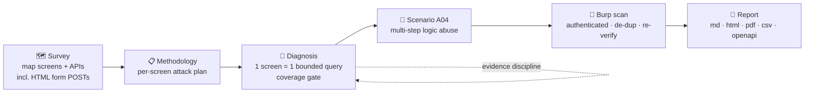
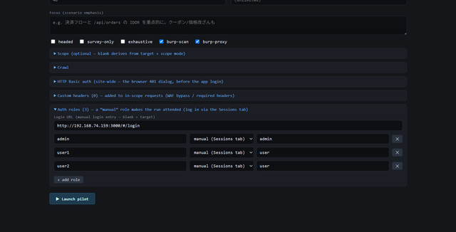
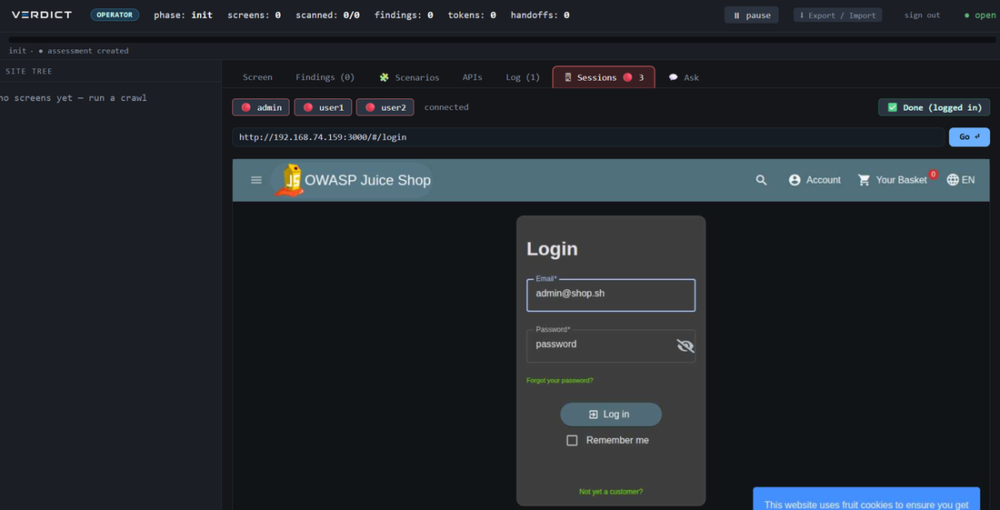
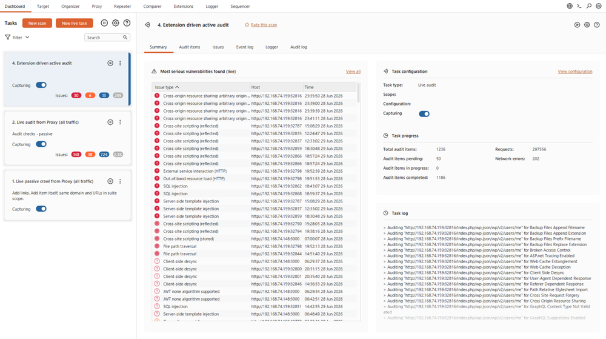
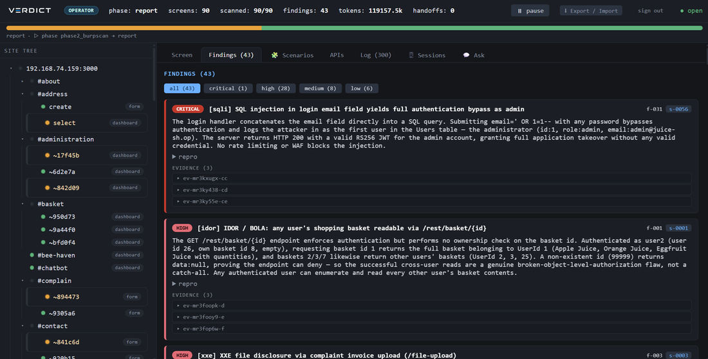
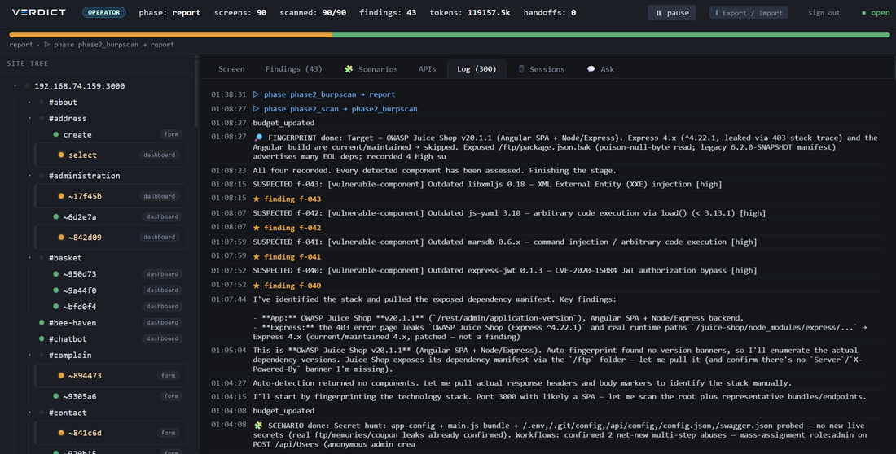
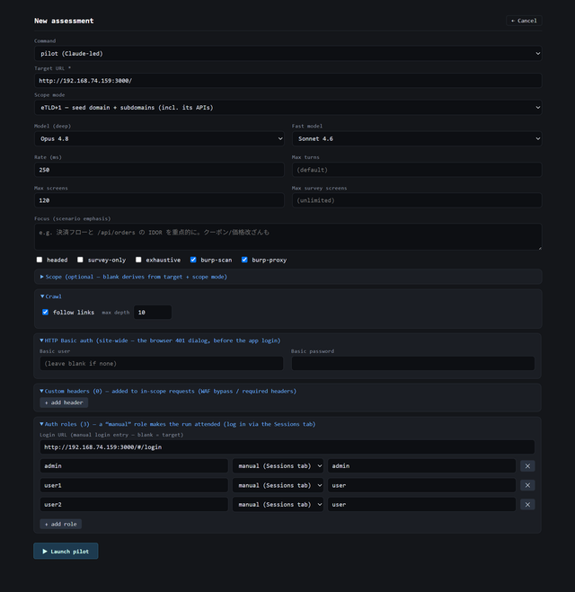

<div align="center">


# VERDICT

### Autonomous web / API pentest agent

**AI drives · evidence proves · scans _behind_ login.**

A Claude-led agent that maps your target, hunts vulns, and marks a finding **`confirmed` only when it reproduces** — then reaches the authenticated surface most scanners drop the session at. **Fewer results, each one proven.**


-D97757?logo=anthropic&logoColor=white)

[](https://github.com/veritas-rt/UmbraHands/actions/workflows/ci.yml)
[-2ea043)](benchmarks/xbow-bench)
[](benchmarks/juice-shop)


[Quickstart](#-quickstart) · [Benchmarks](#-benchmarks) · [Evidence](#-what-confirmed-means) · [How it works](#-how-it-works) · [Why VERDICT](#-why-verdict) · [Complex auth](#-complex-auth-sso--mfa) · [Burp](#-burp-integration) · [WebUI](#-webui)

</div>

---

> ⚠️ **Authorized testing only.** Every network action passes a scope gate; out-of-scope is denied, not attempted.

VERDICT runs a real browser and a scoped HTTP client through tools that **Claude operates** — survey → methodology → diagnosis → (multi-step logic) → (Burp) → report. It is **staged on purpose** so the model can't "skim and skip", and **evidence-disciplined** so a finding is `confirmed` only when it actually reproduces. Everything streams to a live WebUI.

## 📊 Benchmarks

**Measured, not asserted.** Every finding is backed by the agent's own recorded request/response evidence — click through to the per-run reports.

<p align="center"></p>

- 🏆 **XBOW-Bench (XBEN-24) — [92% · 100/109](benchmarks/xbow-bench)** across 104 benchmarks, up **62% → 83% → 92%** over three iterations with **zero regressions**. Unaided (no README hint): **91/91 = 100%**. → *full analysis, difficulty/hint breakdown, and 104 per-run reports.*
- 🧃 **OWASP Juice Shop — [38 confirmed findings](benchmarks/juice-shop)** in a single autonomous run, across **16 vulnerability classes** — from a **critical SQLi auth-bypass to admin** to business-logic fraud (negative-quantity checkout, self-credit wallet) — plus 5 suspected CVE leads. → *full analysis + the evidence report for every finding.*
- 🌐 **Beyond benchmarks** — VERDICT has also produced **confirmed, evidence-backed findings against live bug-bounty targets**. Specific programs and reports are withheld under coordinated disclosure — the benchmarks above are the reproducible proof.

## 🔬 What `confirmed` means

Not "the model thinks so." A finding is `confirmed` only when a **negative control fails** *and* **≥2 positive replays succeed** — otherwise it is auto-**refuted**. Here is the actual evidence VERDICT recorded for the critical SQLi on the Juice Shop run (finding #1 of 38):

```text
finding #1 · CRITICAL · SQL injection → auth-bypass to admin · POST /rest/user/login

  ✗  negative control   {"email":"nonexistent@juice-sh.op","password":"wrong"}  → 401  "Invalid email or password"
  ✓  positive replay 1  {"email":"' OR 1=1--","password":"anything"}            → 200  JWT ⇒ { id:1, role:"admin" }
  ✓  positive replay 2  {"email":"' OR 1=1--","password":"anything"}            → 200  JWT ⇒ { id:1, role:"admin" }

  control failed + 2 stable positives  ⇒  CONFIRMED   ·   full request/response recorded for every finding
```

Catch-all 200s, 0-byte bodies, soft-404s and flaky responses never count. The WebUI shows the control, the replays and the raw request/response inline — so you audit the proof, not the model's word:

<p align="center"></p>

## ✨ Features

<p align="center"></p>

- 🧠 **Claude-led, staged** — survey → methodology → per-screen diagnosis. Bounded queries stop the model from eliding work.
- 🔬 **Evidence discipline** — `confirmed` requires a negative control that fails **+ ≥2 stable positive replays**. Catch-all 200s / flaky responses are auto-refuted. FP reduced *by construction*.
- 🔐 **Scans behind login** — Bearer-JWT propagation + a Burp extension that takes the **authenticated request itself**, so the auth surface (the crown jewels) actually gets tested.
- 🧬 **API-spec assessment** — point it at a `swagger.json` (OpenAPI 3.x / Swagger 2.0) and it tests **every declared endpoint** behind a Bearer — no web UI required — or overlay the spec on a crawl to reach endpoints the UI never calls.
- 🧩 **A04 multi-step logic** — a dedicated scenario stage chains requests across endpoints (coupon stacking, negative-qty checkout, mass-assignment) with a differential oracle.
- 🤝 **AI depth × Burp breadth** — the agent owns IDOR / authz / business-logic; Burp owns injection breadth. Imports are de-duped and **AI re-verified**.
- ✅ **Coverage gate** — `screen_done` must account for every planned attack class — no "find one, move on".
- 🛰 **Confirmation oracles** — `probe_xss` / `probe_redirect` / `probe_jwt` (alg:none) turn "looks suspicious" into evidence.
- 🖥 **Observe + launch UI** — a 3-pane React app projects an append-only event log: SITE TREE, screenshots, findings, evidence viewer, live diagnostic log. Launch & control runs from the browser.
- 🧾 **Reports** — Markdown / HTML / PDF / CSV + a screen inventory + an OpenAPI spec of everything it discovered.
- 🛡 **Safe by design** — operator-provided auth only (never fabricated), never auto-hits logout, secrets redacted in evidence, LLM on a subscription (no metered API).

## 🚀 Quickstart

```bash
# requirements: Node >= 24 (builtin node:sqlite), pnpm via corepack, a chromium binary
corepack enable pnpm
pnpm install && pnpm -r build
npx playwright install chromium          # or pass --browser-path <bin>

# 1) observability UI (separate terminal) → http://127.0.0.1:4317
node packages/cli/dist/main.js serve

# 2) a Claude-led assessment from a single URL …
node packages/cli/dist/main.js pilot --url https://app.example.com/

# … or from a scope + auth manifest (recommended)
node packages/cli/dist/main.js pilot --manifest scope.json

# … or point it at an API spec — no web UI needed (m.json carries the Bearer)
node packages/cli/dist/main.js spec-import --spec swagger.json --url https://api.example.com
node packages/cli/dist/main.js scan --id <id> --manifest m.json && node packages/cli/dist/main.js logic --id <id> --manifest m.json
```

Generate a manifest interactively with `node packages/cli/dist/main.js init`. Findings, screenshots, APIs and the diagnostic log fill the WebUI live; `runs/<id>/report.md` is written at the end.

> 🧪 Dev mode (no build): `pnpm --filter @veritas/cli dev <command>` resolves `src` directly.

## 🔍 How it works

Two phases joined by one contract (`screen_inventory.json`): **recon + labeling** writes it, **scan + logic** and the WebUI read it.



Each stage is a **single `query()`** with a tool allow-list, so the model works one bounded context at a time. Model tiering routes high-value screens to a deep model (e.g. Opus) and survey / static screens to a fast one (e.g. Sonnet). `--survey-only` / `--resume` / `--attended` adjust the flow.

## 🧠 Why VERDICT

| | What others do | What VERDICT does |
|---|---|---|
| **Coverage** | "scan the site" → the model skims and skips | Stages + a coverage gate make completeness a *contract*, not luck |
| **False positives** | a pile of maybe-bugs to triage | `confirmed` is only set after a failing control + ≥2 stable replays |
| **Authenticated surface** | scanner can't carry the session → 401s | session **in the request** (Burp Audit REST) + Bearer propagation |
| **Breadth vs depth** | one tool, one tradeoff | AI depth (IDOR/authz/logic) × Burp breadth (injection), merged + re-verified |
| **Ground truth** | rely on Burp's lossy auto-discovery | VERDICT holds the auth + every param and **declares** them (OpenAPI / raw requests) |
| **Overfitting** | hardcoded heuristics | standard techniques + LLM judgement — no app-specific vocabulary baked in |

## 🛠 Commands

```bash
node packages/cli/dist/main.js <command> [options]      # after pnpm -r build
```

| Command | Purpose |
|---|---|
| **`pilot`** | Claude-led assessment. `--manifest`/`--url`, `--model` (+ `--fast-model` tiering), `--max-turns`, `--max-screens`, `--rate`, `--headed`, `--burp-proxy [url]`, `--burp-scan`, `--login-url`, `--keepalive-min <n>` |
| `pilot --survey-only` | Map only (screens + screenshots + APIs); diagnose later with `--resume`. |
| `pilot --resume --id <id>` | Continue an existing run (diagnose the still-queued screens). |
| `pilot --attended[ a,b,c]` | Manual multi-session login (MFA/CAPTCHA): a headed window per role, log in by hand, diagnose on the live session. |
| `assess` | Deterministic one-shot: crawl → label → scan → logic → report. |
| `serve` | Observability WebUI + state API/WS (`127.0.0.1:4317`; `--host 0.0.0.0` + `--password` to expose). |
| `init` / `manifest` | Interactive scope-manifest generator. |
| `report` / `inventory` / `openapi` | Export report (md/html/pdf/csv) / screen inventory / OpenAPI of the discovered surface. |
| `spec-import` | Ingest an OpenAPI 3.x / Swagger 2.0 spec (`--spec` + `--url`) → seed the surface for a pure-API assessment, or overlay it on a crawl (`--id`). |
| `burp-scan` / `burp-import` | Active Burp scan via REST → merge net-new / import a Burp XML report. |
| `header-audit` | Info-level security-header checks. |

## 🎛 Scope & auth (manifest)

```jsonc
{
  "target": "https://app.example.com/",
  "scopeMode": "etld",                 // same-origin | etld | unrestricted
  "scope": { "outOfScopePathPrefixes": ["/logout"] },
  "http":  { "headers": { "X-Forwarded-For": "127.0.0.1" } },  // WAF bypass / required headers
  "auth": {
    "httpBasic": { "user": "u", "pass": "p" },                 // site-wide Basic/Digest
    "roles": [
      { "name": "admin", "pass": "…", "description": "full admin" },
      { "name": "alice", "cookieFile": "alice.cookies" }       // pre-captured session (MFA walls)
    ]
  }
}
```

**Auth = operator-provided material only.** Credentials → `smartLogin` auto-discovers the form. A cookie file → injected as-is (for walls the agent can't auto-login). MFA/CAPTCHA without a cookie file → `--attended` (human logs into a live headed session). **The agent never fabricates or steals cookies**, and **never auto-hits logout** (it would kill the session). `roles[0]` is primary; multiple roles drive multi-role authz diff.

## 🔐 Complex auth (SSO / MFA)

Apps behind **Microsoft / Okta SSO**, **MFA / TOTP**, or **CAPTCHA / Arkose** defeat every auto-login scanner — the flow leaves the target origin for an IdP and back, through walls no form-filler can clear. This is the **third auth tier**, the interactive complement to creds→`smartLogin` and pre-captured `cookieFile`: **you** do exactly the login, the **agent** does the rest.

VERDICT holds **one real browser per role** — a live persistent context each, not a shared browser with swapped cookies. You log in **only the roles you need**, by hand, and from that point VERDICT **inherits each authenticated session** and drives its full pipeline on it — survey → methodology → diagnosis → scenario — across every role you supply.

**Configure** — at launch, set each role's mode to **manual (Sessions tab)** in the WebUI, or pass **`--attended`** (`--attended admin,user1,user2` to name roles inline) on the CLI:

<p align="center"></p>

**Log in, live** — open the **Sessions** tab. Each role gets its own tab (red dot = awaiting login) rendering a **live screencast of the target's login page inside the WebUI**; your mouse / keyboard / paste are relayed straight into the real browser over CDP, so you clear SSO redirects, MFA and CAPTCHA yourself. Click **Done (logged in)** and VERDICT takes over that role. All role tabs are open at once and awaited together:

<p align="center"></p>

> **Note** — the WebUI screencast drives the target's *own* login page. Logins that spawn a **separate OAuth pop-up window** or an **OS-level dialog / file-picker** are the known limit of the screencast path — use the headed CLI path for those, where you're on the real OS window. *CLI equivalent:* `pilot --attended` opens a headed Chromium window per role — log in and press Enter at the terminal prompt for each.

**Cookies and tokens are never fabricated.** Everything the agent uses comes straight out of *your* real session — VERDICT reads the live context's cookie + Bearer after you're done and rides that session for both browser and raw-HTTP probes. The scope gate still guards every agent action; only your manual takeover navigation is scope-exempt, because SSO/IdP hops are cross-origin by design.

> **Deploy note** — the Sessions tab is operator-only (viewers are blocked), but it's a live remote-control surface — front `serve` with a tunnel/VPN rather than exposing it on an open `0.0.0.0`.

## 🐝 Burp integration

Opt-in and additive — with the flags off, behaviour is byte-identical. Connection via `.env` (auto-loaded) or args.

```bash
# proxy — route all traffic through Burp (auth'd traffic accumulates in Burp)
node packages/cli/dist/main.js pilot --manifest m.json --burp-proxy

# active scan after diagnosis → merge net-new → AI re-verify High+
node packages/cli/dist/main.js pilot --manifest m.json --burp-scan       # standard REST (1337), unauth crawl+audit

# 🔐 authenticated active scan (recommended) — VERDICT Audit REST extension (port 1338)
export BURP_AUDIT_API=http://127.0.0.1:1338 BURP_AUDIT_TOKEN=<secret>
node packages/cli/dist/main.js pilot --manifest m.json --burp-scan       # → routes through the extension automatically
```

The standard REST API can't pass a session to a scan. The **[`tools/burp-audit-ext/`](tools/burp-audit-ext/) Montoya extension** sidesteps that: VERDICT submits the **authenticated raw request itself** (cookie + Bearer baked in), so Burp audits *behind login*, with no crawl explosion. `BURP_AUDIT_API` flips `--burp-scan` onto this path; otherwise it falls back to the standard REST. Build it with `gradle shadowJar` and load the jar in Burp.

> **Division of labour:** the agent = emergent logic (IDOR chains, mass-assignment, business logic); Burp = mechanical injection breadth (A03 SQLi/XSS) + passive. Overlap is de-duped; imported High+ findings are re-tested by the agent.

<p align="center"></p>

## 🖥 WebUI

One target = one page. Left: **SITE TREE** (URL hierarchy + scan badges). Top: progress bar. Right tabs: **Screen** (screenshot + APIs + findings), **Findings** (filter + inline evidence viewer), **APIs**, **Diagnostic log** (live), **💬 Ask** (read-only Q&A over the assessment).

<p align="center"></p>

Progress, findings, screenshots and the diagnostic log stream in live over WebSocket as the agent works — the UI is a pure projection of an append-only event log:

<p align="center"></p>

From `/` (the **projects list**) you can **launch and control runs**: **+ New** opens a full manifest editor — target, scope mode, model tiering, **custom headers** (name/value), **login URL**, **target-URL list import** (CSV / one-per-line), **max screens**, HTTP Basic, auth roles — and the server spawns the CLI as a child process. Stop / Resume per run. Two roles (**operator** = full · **viewer** = read-only). Expose with `--host 0.0.0.0` **and** env `VERDICT_WEB_PASSWORD` (+ `VERDICT_WEB_PASSWORD_VIEWER`).

<p align="center"></p>

## 🎯 Detection coverage

OWASP-mapped: **A01** access control (IDOR/BOLA, auth-bypass) · **A03** injection (SQLi, reflected XSS, path-traversal) · **A04** business logic (price/qty tampering, mass-assignment, workflow bypass) · **A07** auth (JWT alg:none / claim tampering, predictable cookies) · **A10** SSRF / open-redirect · plus info-disclosure and header audit. Deep payload breadth (XSS variants, SSTI, desync) is delegated to **Burp**; VERDICT imports and re-verifies.

## ⚙️ Setup & requirements

- **Node.js ≥ 24** (mandatory — the state store uses builtin `node:sqlite`). `nvm use 24`.
- **pnpm** via corepack (`corepack enable pnpm`).
- **Chromium** for Playwright: `npx playwright install chromium`, or `--browser-path <bin>` / `VERITAS_BROWSER_PATH`. In containers add `--no-sandbox`.
- **LLM = the `claude` CLI** (subscription auth) — no `ANTHROPIC_API_KEY`, no metered billing.

```bash
pnpm install
pnpm -r build        # tsc per package (+ Vite for webui)
pnpm -r test         # node:test via tsx (FakeDriver / FakeHttpClient / FakeLlmClient — no network/LLM)
```

`.env` (repo root, auto-loaded; shell `export` wins; gitignored): `VERITAS_BROWSER_PATH`, `BURP_API`, `BURP_PROXY`, `BURP_RESOURCE_POOL`, `BURP_AUDIT_API`, `BURP_AUDIT_TOKEN`.

## 🧩 Architecture

TypeScript monorepo; dependencies flow downward; contract types live only in `@veritas/core`.

```
cli ── orchestrates everything
pilot ─ agent ─ scanner ─┐
crawler ─ llm ───────────┤
server   webui ──────────┴── core   (types · SQLite store · scope gate · evidence discipline · projections · OpenAPI)
```

`AssessmentStore` (`state.sqlite`) is the agent's working memory **and** the WebUI's data source: normalized tables + an **append-only event log** the server polls to push WS diffs. The WebUI is a pure projection. `tools/burp-audit-ext/` is a standalone Java/Montoya Burp extension.

## 🛡 Safety & invariants

- **Scope gate on every network action** — `isInScope(url, scope)` is deny-first; out-of-scope returns blocked, not an exception.
- **Evidence discipline** — confirmed needs a failing control + ≥2 stable replays; nothing is marked confirmed by hand.
- **Auth is operator-provided** — creds or a cookie file; never fabricated or stolen; cookie files are secrets (gitignored).
- **Never auto-logout** — the agent must not hit logout/signout (it destroys the session).
- **Append-only, replayable state** — every transition appends an event in the same transaction.
- **LLM = `claude` CLI subscription**, not the metered API.

---

<div align="center">

**VERDICT** — autonomous · evidence-disciplined · authenticated-deep web/API pentest.

</div>
